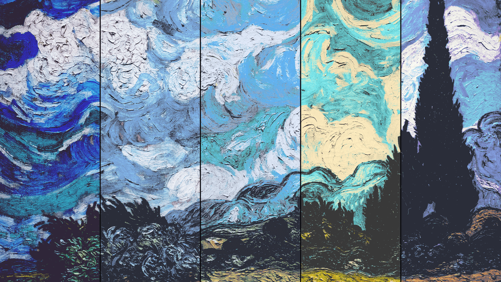

<h1 align="center"><a href="https://ziap.github.io/image-themer">Image theme changer</a></h3>

Recolor images to match a color palette.

Useful for converting wallpapers for consistent theming.

# Demo

Theme from left to right: [Original](https://i.redd.it/i0eebbqruun71.jpg), Nord, One Dark, Gruvbox, Dracula.

# How does it work?

 - Go through every pixel of an image.
 - Set it to the closest color from a palette.
 - Adjust the brightness to match the original pixel.

# Limitations

Converting images to a palette with less colors are likely to reduce the quality.
So keep in mind that the program works best with palette that have 16 or more colors and images that have distinct colors and outlines, minimal blur/gradient and high resolution.

# Improvements

 - [ ] Consider neighboring pixels when selecting color.
 - [ ] ...
 - [ ] Improve the UI.

# License

This app is licensed under the [MIT license](LICENSE).
